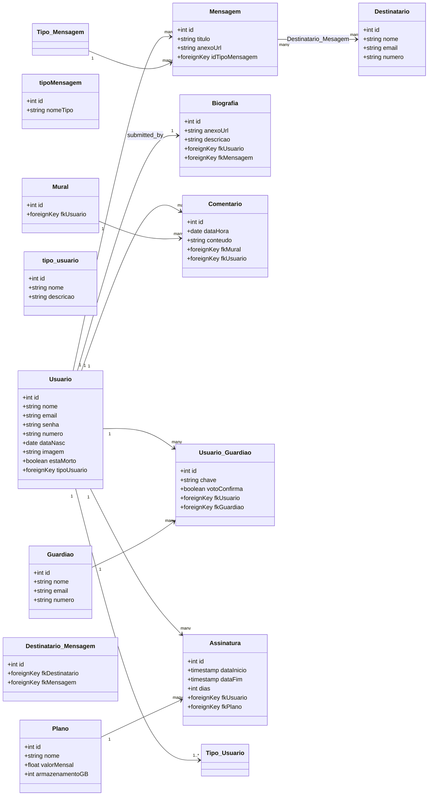

```mermaid
classDiagram
direction LR

class Usuario {
  +int id
  +string nome
  +string email
  +string senha
  +string numero
  +date dataNasc
  +string imagem
  +boolean estaMorto
  +foreignKey tipoUsuario
}

class Destinatario {
  +int id
  +string nome
  +string email
  +string numero
}

class tipoMensagem {
  +int id
  +string nomeTipo
}

class Guardiao {
  +int id
  +string nome
  +string email
  +string numero
}

class tipo_usuario {
  +int id
  +string nome
  +string descricao
}

class Plano {
  +int id
  +string nome
  +float valorMensal
  +int armazenamentoGB
}

class Mensagem {
  +int id
  +string titulo
  +string anexoUrl
  +foreignKey idTipoMensagem
}

class Biografia {
  +int id
  +string anexoUrl
  +string descricao
  +foreignKey fkUsuario
  +foreignKey fkMensagem
}

class Mural {
  +int id
  +foreignKey fkUsuario
}

class Comentario {
  +int id
  +date dataHora
  +string conteudo
  +foreignKey fkMural
  +foreignKey fkUsuario
}

class Usuario_Guardiao {
  +int id
  +string chave
  +boolean votoConfirma
  +foreignKey fkUsuario
  +foreignKey fkGuardiao
}

class Destinatario_Mensagem {
  +int id
  +foreignKey fkDestinatario
  +foreignKey fkMensagem
}

class Assinatura {
  +int id
  +timestamp dataInicio
  +timestamp dataFim
  +int dias
  +foreignKey fkUsuario
  +foreignKey fkPlano
}

%% Relacionamentos
Usuario "1" --> "1" Biografia : submitted_by
Usuario "1" --> "many" Comentario
Mural "1" --> "many" Comentario
Usuario "1" --> "many" Usuario_Guardiao
Guardiao "1" --> "many" Usuario_Guardiao
Usuario "1" --> "1..*" Tipo_Usuario
Usuario "1" --> "many" Assinatura
Plano "1" --> "many" Assinatura
Usuario "1" --> "many" Mensagem
Tipo_Mensagem "1" --> "many" Mensagem
Mensagem "many" --> "many" Destinatario : Destinatario_Mesagem
```
